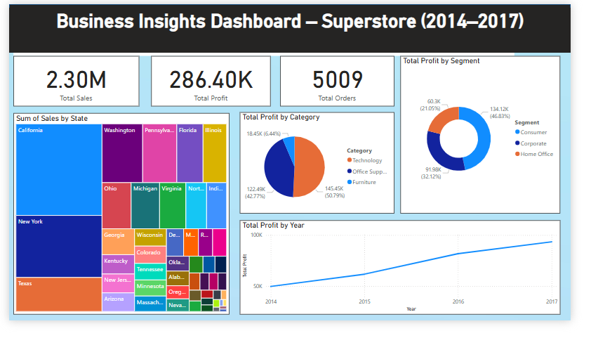

# 📊 Business Insights Dashboard – Superstore (2014–2017)

This project was created as part of a **Data Analyst Internship Task 2: Data Visualization and Storytelling**. The goal was to create a compelling and insightful Power BI dashboard using the Superstore sales dataset.

---

## 📁 Dataset

- **Source**: [Sample - Superstore.csv](https://www.kaggle.com/datasets/vivek468/superstore-dataset-final)
- **Time Period**: 2014 – 2017
- **Fields Used**: Order Date, Sales, Profit, Discount, Category, Sub-Category, State, Region, Segment

---

## 🛠 Tools Used

- **Power BI Desktop**
- **DAX (Data Analysis Expressions)** for creating measures
- **Treemaps, Cards, Pie/Donut Charts, Line Charts** for visualization

---

## 📌 Dashboard Highlights

### KPIs
- 🟢 **Total Sales**: 2.30M  
- 🟢 **Total Profit**: 286.4K  
- 🟢 **Total Orders**: 5009  

### Visual Insights
- 📍 **Sales by State**: California, New York, and Texas lead in sales.
- 📈 **Total Profit by Year**: Steady growth observed across 2014–2017.
- 🧩 **Profit by Category**: Technology and Office Supplies dominate; Furniture has lower profit.
- 👥 **Profit by Segment**: The Consumer segment contributes the highest profit share (46.8%).

---

## 🔍 Key Business Insights

- 📦 **Top contributing states**: California, New York, Texas
- 📉 **Furniture** category needs profitability review.
- 📈 **Profit trend**: Positive year-over-year growth
- 🎯 **Consumer segment** is the most profitable
- 📊 **Technology** products yield the highest profit margins

---

## 📷 Dashboard Screenshot

---

